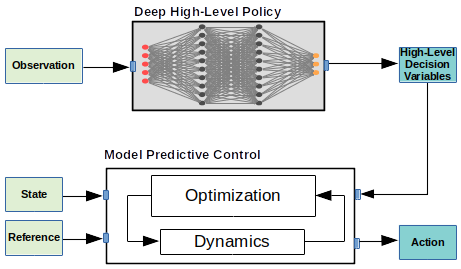

## Learning High-Level Policies for Model Predictive Control

<!--  -->


The combination of policy search and deep neural networks holds the promise of automating a variety of decision- making tasks. Model Predictive Control (MPC) provides robust solutions to robot control tasks by making use of a dynamical model of the system and solving an optimization problem online over a short planning horizon. In this work, we leverage probabilistic decision-making approaches and the generalization capability of artificial neural networks to the powerful online optimization by learning a deep high-level policy for the MPC (High-MPC). Conditioning on robot’s local observations, the trained neural network policy is capable of adaptively selecting high-level decision variables for the low-level MPC controller, which then generates optimal control commands for the robot. First, we formulate the search of high-level decision variables for MPC as a policy search problem, specifically, a probabilistic inference problem. The problem can be solved in a closed-form solution. Second, we propose a self-supervised learning algorithm for learning a neural network high-level policy, which is useful for online hyperparameter adaptations in highly dynamic environments. We demonstrate the importance of incorporating the online adaption into autonomous robots by using the proposed method to solve a challenging control problem, where the task is to control a simulated quadrotor to fly through a swinging gate. We show that our approach can handle situations that are difficult for standard MPC.

### Publication

If you use this code in a publication, please cite the following paper:
Y. Song and D. Scaramuzza, 
"**Learning High-Level Policies for Model Predictive Control**,"
IEEE/RSJ International Conference on Intelligent Robots and Systems (IROS), Las Vegas, 2020. [[PDF](http://rpg.ifi.uzh.ch/docs/IROS20_Yunlong.pdf)]

```
@InProceedings{Yunlong2020,
  author = {Song, Yunlong and Scaramuzza, Davide},
  title = {Learning High-Level Policies for Model Predictive Control},
  booktitle = {IEEE/RSJ Int. Conf. Intell. Robot. Syst. (IROS)},
  year = {2020}
}
```

Please find a list of demonstrations in [here](docs/gifs/README.md). 


### Installation 

Clone the repo

```
git clone git@github.com:uzh-rpg/high_mpc.git
```

Installation Dependencies:

```
cd high_mpc
pip install -r requirements.txt
```

Add the repo path to your PYTHONPATH by adding the following to your ~/.bashrc

```
export PYTHONPATH=${PYTHONPATH}:/path/to/high_mpc
```

### Run 

Standard MPC

```
cd high_mpc
python3 run_mpc.py
```

Learning a High-Level Policy

```
python3 run_highmpc.py 
```

Learning a Deep High-Level Policy

```
# collect training data for the MLP
python3 run_deep_highmpc.py --option 0

# train the deep high-level policy with pre-collected data
python3 run_deep_highmpc.py --option 1

# evaluate the performance with pre-trained deep high-level policy
python3 run_deep_highmpc.py --option 2
```

