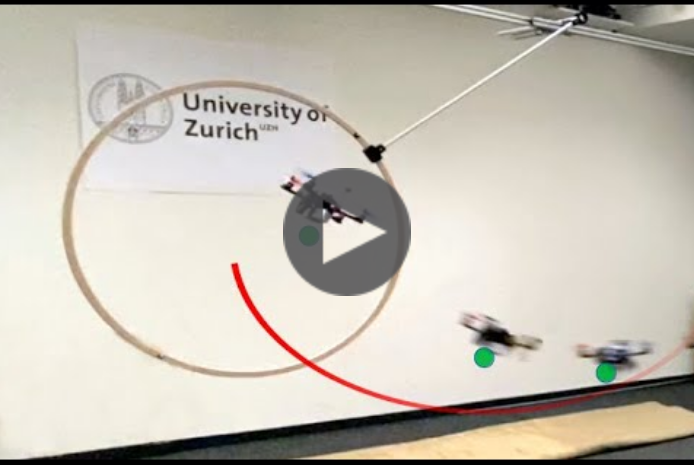

## Policy Search for Model Predictive Control with Application to Agile Drone Flight

<!-- [](https://youtu.be/Qei7oGiEIxY) -->


Policy Search and Model Predictive Control (MPC) are two different paradigms for robot control: policy search has the strength of automatically learning complex policies using experienced data, while MPC can offer optimal control performance using models and trajectory optimization. An open research question is how to leverage and combine the advantages of both approaches. In this work, we provide an answer by using policy search for automatically choosing high-level decision variables for MPC, which leads to a novel policy-search-for-model-predictive-control framework. Specifically, we formulate the MPC as a parameterized controller, where the hard-to-optimize decision variables are represented as high-level policies. Such a formulation allows optimizing policies in a self-supervised fashion. We validate this framework by focusing on a challenging problem in agile drone flight: flying a quadrotor through fast-moving gates. Experiments show that our controller achieves robust and real-time control performance in both simulation and the real world. The proposed framework offers a new perspective for merging learning and control.

### Publication

If you use this code in a publication, please cite the following papers:

Y. Song and D. Scaramuzza,
"**Policy Search for Model Predictive Control with Application to Agile Drone Flight**,"
IEEE Transaction on Robotics (T-RO), 2021.
[[PDF](http://rpg.ifi.uzh.ch/docs/TRO21_Yunlong.pdf)][[Video](https://youtu.be/Qei7oGiEIxY)]

Y. Song and D. Scaramuzza,
"**Learning High-Level Policies for Model Predictive Control**,"
IEEE/RSJ International Conference on Intelligent Robots and Systems (IROS), Las Vegas, 2020.
[[PDF](http://rpg.ifi.uzh.ch/docs/IROS20_Yunlong.pdf)][[Video](https://youtu.be/2uQcRnp7yI0)]

```
@article{song2022policy,  
  author={Song, Yunlong and Scaramuzza, Davide},  
  journal={IEEE Transactions on Robotics},   
  title={Policy Search for Model Predictive Control With Application to Agile Drone Flight},   
  year={2022}, 
  pages={1-17},  
  doi={10.1109/TRO.2022.3141602}
}
```
```
@inProceedings{song2020learning,
  title={Learning High-Level Policies for Model Predictive Control},
  author={Song, Yunlong and Scaramuzza, Davide},
  booktitle={IEEE/RSJ International Conference on Intelligent Robots and Systems (IROS)},
  year={2020}
}
```
### Demonstrations

Please find a list of demonstrations in [here](docs/gifs/README.md) and in the video below:

[](https://youtu.be/Qei7oGiEIxY)


### Installation

Clone the repo

```
git clone git@github.com:uzh-rpg/high_mpc.git
```

Installation Dependencies:

```
cd high_mpc
pip install -r requirements.txt
```

Add the repo path to your PYTHONPATH by adding the following to your ~/.bashrc

```
export PYTHONPATH=${PYTHONPATH}:/path/to/high_mpc
```

### Run

Standard MPC

```
cd high_mpc
python3 run_mpc.py
```

Learning a High-Level Policy

```
python3 run_highmpc.py
```

Learning a Deep High-Level Policy

```
# collect training data for the MLP
python3 run_deep_highmpc.py --option 0

# train the deep high-level policy with pre-collected data
python3 run_deep_highmpc.py --option 1

# evaluate the performance with pre-trained deep high-level policy
python3 run_deep_highmpc.py --option 2
```
